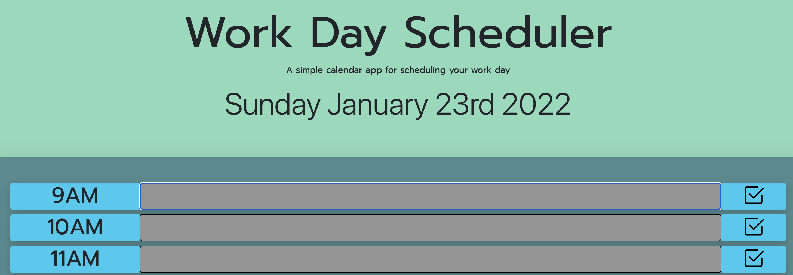

 

# Work Day Scheduler 

A simple calendar application that allows a user to save events for each hour of the work day. This app will run in the browser and feature dynamically updated HTML and CSS powered by jQuery.

 

 

- Moment.Js was used to fetch the current time, and use it to color coordinate the scheduler depending if the task is in the past, present or future 

    - grey = past   
    - red = present 
    - green = future 

 

- LocalStorage was used to save user input with a click of each respective button, and display these results back on the page

 

- Bootstrap was used to style the CSS.
